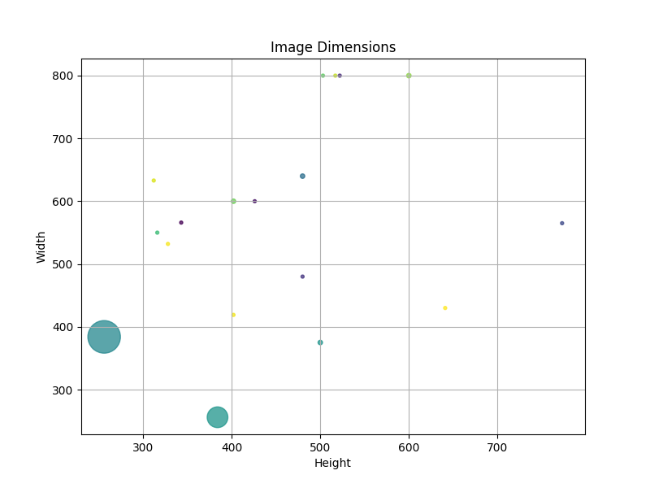

# Image Forgery Detection (Lightning + WandB)


### Problem Statement:    

Vision Systems can be fooled with various input side attacks like using algorithms like content-aware fill and PatchMatch, Content-Aware Healing, Clone-Stamp, Inpainting, Alpha-matting, seam carving etc. OR simple physical printed(2D/3D) photos of another person for facial security recognition models. The task is to *detect authentic images from algorithmically manipulated* ones. 


**TL;DR**

0. Detection of authentic/natural/un-altered images.

1. Detection of copied segments in the same image (copy-move) **Harder** (based on qualitative dataset surveying)

2. Detection of merged images (slicing)   

Overall, classify images into 3 categories: authentic (0), copy-moved (1) or sliced (2). 

> Traditional machine learning and then deep learning based approaches are used in this repo. Also `mixed precision training` is being used across all DL models. 


---

### Naive First Thoughts:

1. Statistics of *patches* (but how big?) in spliced images could differentiate the spliced patches from the natural colors of the image.  

2. An object detector for copy-moved images. But what if parts of the object or things like the sky are copy and moved?

3. Traditional block-matching algorithm could give decent results for copy move but not spliced ones.

4. Just throw a CNN at the problem.

---    

### Dataset:   

* [Download SpoofSense Dataset](https://drive.google.com/file/d/1lUFc9Gx9pK9PlW0MDtoOwolgbHig4W3m/view?pli=1)

To run **everything**, create a `datasets` directory and then unzip the dataset from the link above inside this dir.


Your directory structure should look like this:   

```
.
└── datasets
    └── data
        ├── test
        │   ├── authentic
        │   ├── copy-moved
        │   │   ├── images
        │   │   └── masks
        │   └── spliced
        │       ├── images
        │       └── masks
        └── traindev
            ├── authentic
            ├── copy-moved
            │   ├── images
            │   └── masks
            └── spliced
                ├── images
                └── masks
```

**Note:** Masks are not present for all images!

---    

### EDA:

#### Size:

*Total dataset size*: `4980` images. *Is small ==> Will need to eventually augment.*


| traindev   | 4482 |
|------------|------|
| authentic  | 1494 |
| copy-moved | 1494 |
| spliced    | 1494 |


| test       | 498 |
|------------|-----|
| authentic  | 166 |
| copy-moved | 166 |
| spliced    | 166 |


> *Observation:* Dataset is **balanced** OR **no class imbalance**

**Storage Formats:** *tif*, *png* and *jpg*

**Dynamic Range:** *Low* (`uint8`)    

**Resolution:** 



```
    height  width  count
     256    384    104
     312    633      1
     316    550      1
     328    532      1
     343    566      1
     384    256     42
     402    419      1
     402    600      2
     426    600      1
     480    480      1
     480    640      2
     500    375      2
     503    800      1
     517    800      1
     522    800      1
     600    800      2
     641    430      1
     773    565      1
```

> Resolutions are not all same (*wild dataset collection/assortment*) $->$ Will have to `resize`.

---

## Methods:

### Approach 1: Transfer Learning (Classification Setting) (VGG (16 & 19), ResNet (50 & 101), EfficientNet (b4 & b7)) --> Fine-tuning

Usage:

```
./transfer_learning.py --model <your_model_name> --device <cpu/cuda/cuda:x>
```

where x is the GPU ID on your machine and model should be among [vgg16, vgg19, resnet50, resnet101, effb4, effb6]

---

### Approach 2: Transfer Learning (Segmentation Setting) (U-Net with encoders: ResNet (26B, )) ---> Fine-tuning

---

### Metrics:

---

### References:

1. [Practitioner's Guide to timm](https://towardsdatascience.com/getting-started-with-pytorch-image-models-timm-a-practitioners-guide-4e77b4bf9055)

2. [Forgery Detection Papers Replicated Repo - Umar](https://github.com/umar07/Image_Forgery_Detection/tree/main)

3. [Medium - Image Forgery Detection](https://medium.com/@vvsnikhil/image-forgery-detection-d27d7a3a61d)

---    


